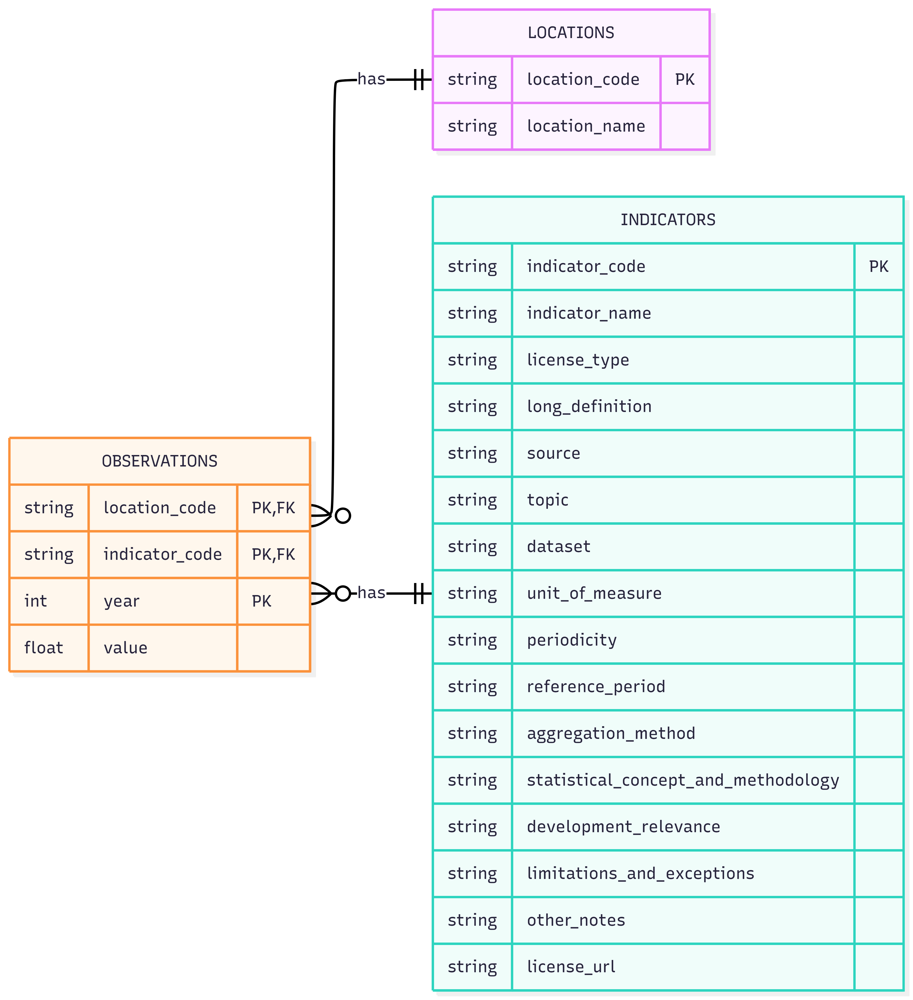

# Dataset

This folder contains the raw World Bank export files used by the lab [link](https://drive.google.com/drive/folders/14e1idijzX3Lplbpkiqig_hth03QCi0lA)

## Folder structure

```text
data/
  ├─ raw/
  │    ├─ data.csv
  │    └─ metadata.csv
  │
  ├─ processed/
  │    ├─ indicators.csv
  │    ├─ locations.csv
  │    └─ observations.csv
  │
  └─ README.md
```



The wide observation file contains 4 identifier columns and 26 yearly value columns, while `metadata.csv` includes the indicator definitions that become the `indicators.csv` table. Blank cells in the generated CSVs represent NULL values.

## Dataset Indicators

The raw data tracks the following core World Bank indicators:

* **Life expectancy at birth, total (years)**: The average number of years a newborn infant would live if prevailing patterns of mortality at the time of its birth were to stay the same throughout its life.
* **Current health expenditure per capita (current US$)**: The average amount of money spent on healthcare per person in that country for that year, expressed in current United States dollars.
* **Mortality rate, infant (per 1,000 live births)**: The number of infants dying before reaching one year of age, per 1,000 live births in a given year.
* **People using at least basic sanitation services (% of population)**: The percentage of the population that has access to improved sanitation facilities that are not shared with other households.
* **People using at least basic drinking water services (% of population)**: The percentage of the population using drinking water from an improved source, provided collection time is not more than 30 minutes for a round trip.
* **Immunization, DPT (% of children ages 12-23 months)**: The percentage of children between the ages of 12 and 23 months who have received the required vaccinations for diphtheria, pertussis (whooping cough), and tetanus.
* **GDP per capita (current US$)**: Gross Domestic Product divided by the midyear population. An indicator of a country's economic output per person.
* **Total alcohol consumption per capita (liters of pure alcohol, projected estimates, 15+ years of age)**: The estimated amount of pure alcohol consumed per person aged 15 years and older over a calendar year.
* **School enrollment, secondary (% gross)**: The ratio of total enrollment in secondary education to the population of the age group that officially corresponds to secondary education.
* **Prevalence of HIV, total (% of population ages 15-49)**: The percentage of people aged 15-49 who are infected with HIV.
* **PM2.5 air pollution, mean annual exposure (micrograms per cubic meter)**: The average level of fine suspended particulate matter (PM2.5) that the population is exposed to over the course of a year.